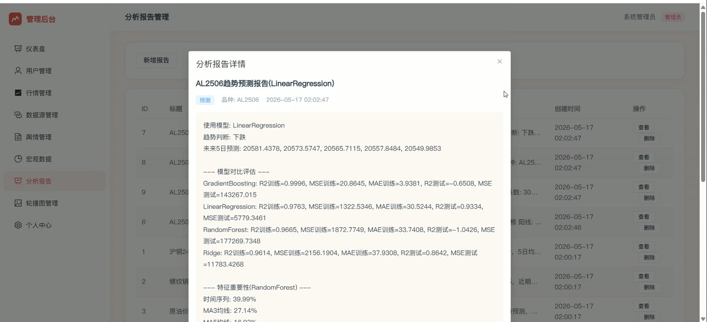
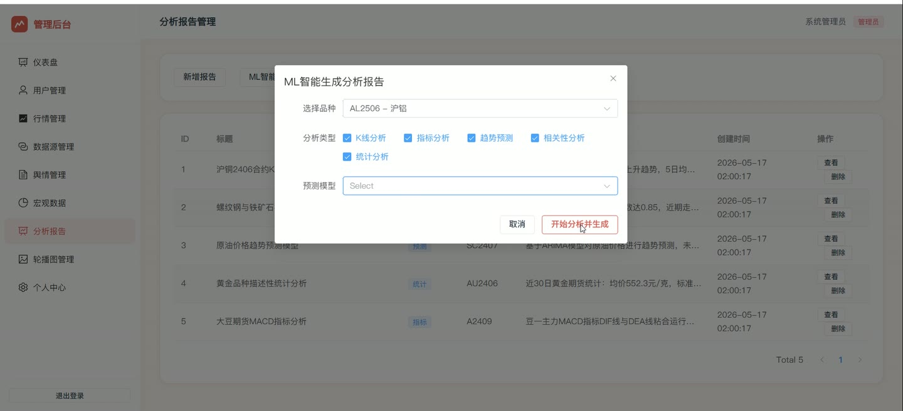
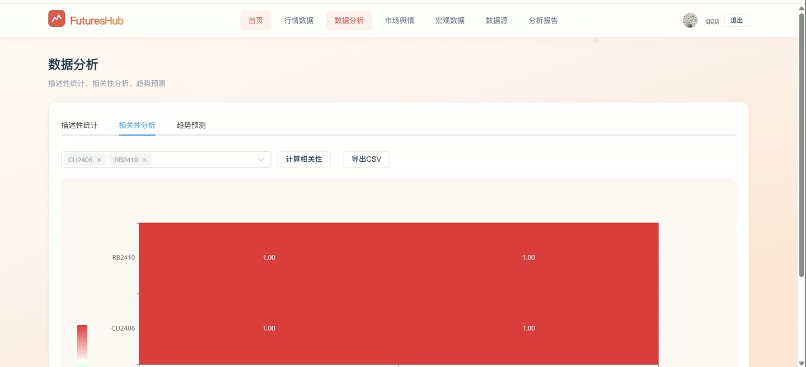
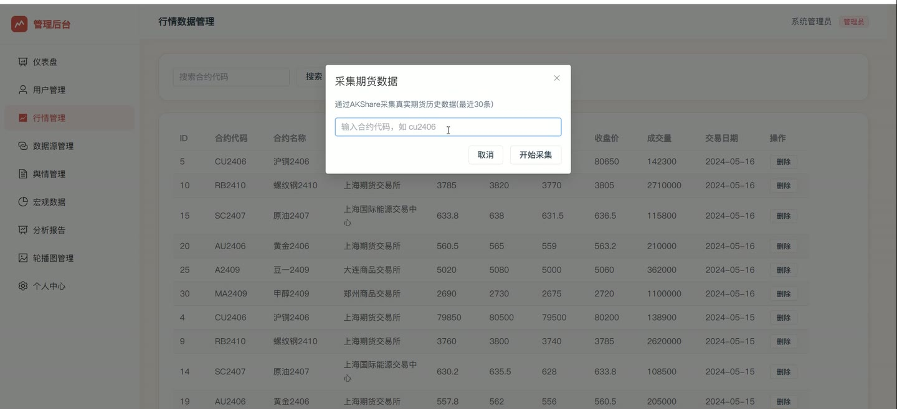
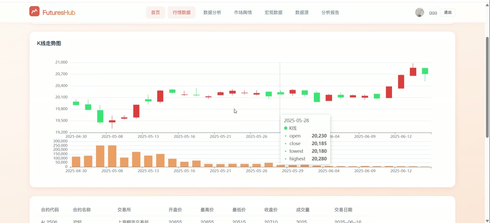

# (附文档)Python+Flask+Vue3 多源期货数据整合与分析系统

**技术栈**：Python、Flask、机器学习、Vue3、MySQL

### 系统简介

本系统是一套基于 Python Flask 与 Vue3 前后端分离架构的多源期货数据整合与分析平台，支持多数据源接入、行情采集、技术指标计算、机器学习趋势预测、舆情与宏观数据管理。系统区分普通用户端与管理员端两类角色，前端采用单页应用路由，后端以蓝图方式拆分认证、行情、分析、数据源、上传、后台、舆情、宏观、轮播图等模块。
 
### 核心功能
 
### 普通用户端

 
- 用户注册：填写用户名、昵称、密码与确认密码，前端校验用户名长度 2-20 位、密码 6-20 位并校验两次密码一致。 
- 用户登录：输入用户名与密码登录，登录成功后按角色跳转，管理员进入后台首页，普通用户进入前台首页。 
- 首页浏览：查看轮播图、行情概览、舆情与报告等前台内容入口。 
- 行情查看：在行情页浏览期货合约的开盘价、最高价、最低价、收盘价、成交量与交易日期等字段。 
- 数据分析-描述性统计：选择品种后计算数据条数、均价、标准差、最低价、最高价、中位数、日均成交量、价格区间与波动率。 
- 数据分析-相关性分析：多选品种调用相关性接口，生成相关系数矩阵并以热力图展示。 
- 数据分析-趋势预测：选择品种与预测模型，查看趋势方向、未来 5 日预测值、模型对比与特征重要性。 
- 结果导出：描述性统计、相关性矩阵、趋势预测结果均可一键导出为 CSV 文件。 
- 舆情浏览：查看舆情列表，含标题、来源、利多/利空/中性情绪标签、关联品种与发布时间。 
- 宏观数据浏览：查看宏观指标名称、数值、单位、发布日期、地区与来源。 
- 报告查看：浏览分析报告列表，查看报告标题、类型、品种、内容与创建时间。 
- 个人中心：修改昵称、邮箱、手机号与密码，支持上传更换头像。
 
### 管理员端

 
- 数据看板：展示用户总数、行情数据量、舆情条数、分析报告数四类统计卡片。 
- 看板图表：以折线图展示多品种收盘价趋势，以饼图展示数据源分布，并列出最新舆情与最新报告。 
- 用户管理：按用户名或昵称搜索用户，编辑昵称、邮箱、手机号、角色与重置密码，启用/禁用账号，删除用户。 
- 行情管理：按合约代码搜索行情，新增行情（合约代码、名称、交易所、开高低收、成交量、持仓量、交易日期），删除行情。 
- 行情采集：输入合约代码调用采集接口获取真实期货历史数据并入库。 
- 数据源管理：新增、编辑、删除数据源，维护名称、类型（API/爬虫/手动）、地址、描述与启用状态。 
- 舆情管理：新增、编辑、删除舆情，维护标题、内容、来源、情绪（利多/利空/中性）、关联品种与发布时间，并支持一键采集舆情数据。 
- 宏观数据管理：新增、删除宏观数据，维护指标名称、数值、单位、发布日期、地区与来源，支持一键采集宏观数据。 
- 报告管理：新增分析报告（标题、类型、品种、内容），查看报告详情与结果数据，删除报告。 
- ML 智能生成报告：选择品种与分析类型（K线/指标/预测/相关性/统计），可选预测模型，批量生成并入库多份分析报告。 
- 轮播图管理：新增、编辑、删除轮播图，维护标题、图片地址、跳转链接、排序与显示状态，支持本地上传图片。 
- 个人资料：查看用户名与角色，修改昵称、邮箱、手机号、密码并上传头像。
 
### 技术栈

 后端框架Python + Flask（蓝图分模块注册） ORMFlask-SQLAlchemy 跨域与鉴权Flask-CORS（supports_credentials）、基于角色的路由守卫 机器学习RandomForest、GradientBoosting、LinearRegression、Ridge 多模型对比 前端框架Vue3 + Element Plus 状态管理Pinia（user store） 路由Vue Router（history 模式，含登录与角色守卫） 构建工具Vite 图表库ECharts（折线、饼图、热力图、柱状图） 数据库MySQL
 
### 交付内容

 
- 后端完整源码 
- 前端完整源码 
- 数据库初始化脚本 
- 万字文档

## 界面展示

---

## 获取完整源码 + 万字文档

本仓库为项目介绍页。**完整前后端源码、数据库初始化脚本、万字项目文档**，请加微信 `kangkangcode`，或访问 [codekk.top](http://codekk.top) 获取。

可作课程设计 / 毕业设计参考，支持远程部署调试。